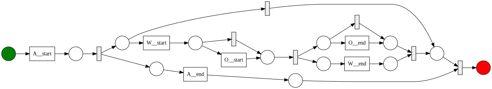
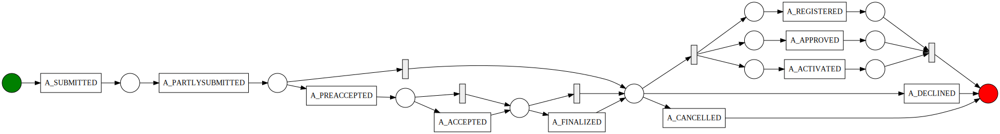
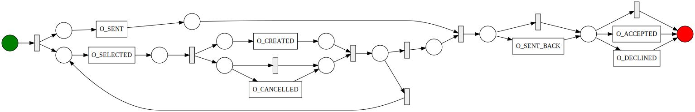

# FlexHMiner : discovering hierarchical process models

This project contains the code and examples of results for FlexHMiner. The approach is implemented as a ProM-plugin. A minimal example is provided in 
- FlexHMiner/example
- FlexHMiner/src/org/procecessmining/aam/Main.java (to run the example)

The details of the approach and its evaluation can be found in: 

[Xixi Lu, Avigdor Gal, hajo A. Reijers (2020). FlexHMiner: Accurate Discovery of Complex Processes
using Hierarchical Process Models]()

## Result - Example BPIC12 log

Applying the FlexHMiner that uses the Inductive Miner and the Domain Knowledge based activity hierarchy on the BPIC12 log, we obtain the following hierarhical process model.

We have the root model: 

And three subprocesses A, O, and W:

March 25, 2020
